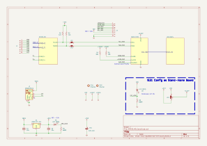
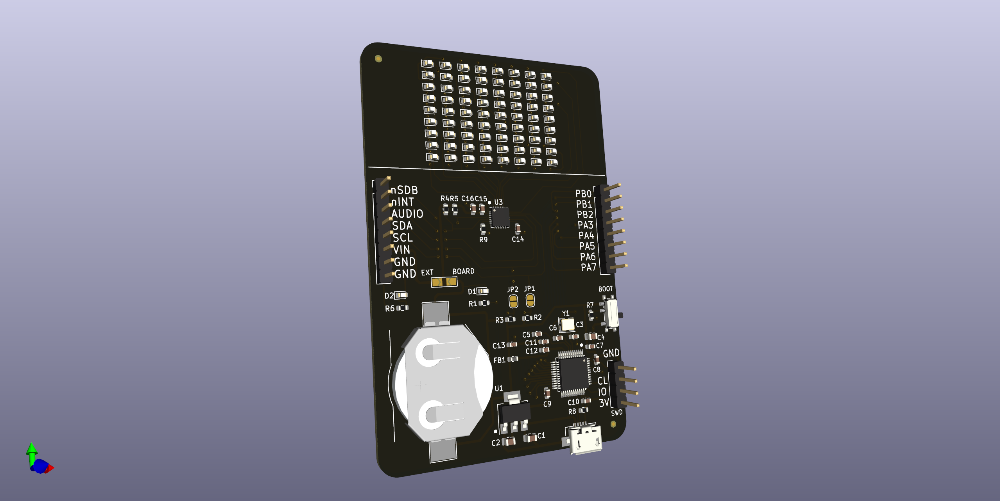
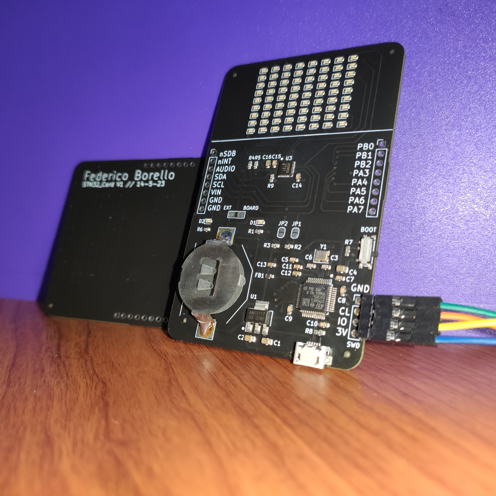
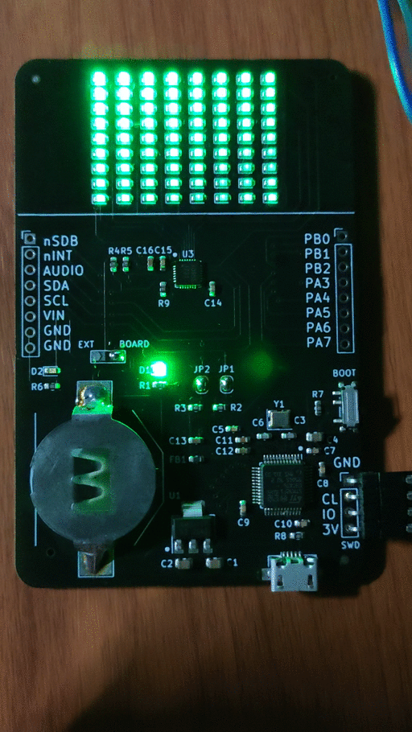

# STM32_Card
This is the first PCB I have designed and professionally assembled. I used KiCAD v7 and JLC PCBs' services.

# Schematic and 3D-view 

# Picture and Demo

*Note: The gif above was made using the Adafruit's Demo:

- [Library](https://github.com/adafruit/Adafruit_IS31FL3731)
- [Overview](https://learn.adafruit.com/i31fl3731-16x9-charliplexed-pwm-led-driver/overview)